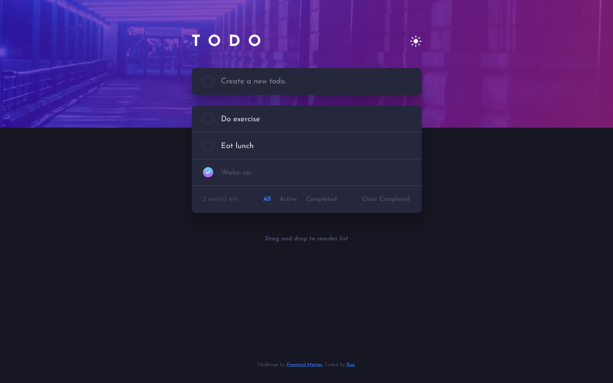

# Frontend Mentor - Todo app solution

This is a solution to the [Todo app challenge on Frontend Mentor](https://www.frontendmentor.io/challenges/todo-app-Su1_KokOW). Frontend Mentor challenges help you improve your coding skills by building realistic projects.

## Table of contents

- [Overview](#overview)
  - [The challenge](#the-challenge)
  - [Screenshot](#screenshot)
  - [Links](#links)
- [My process](#my-process)
  - [Built with](#built-with)
  - [Useful resources](#useful-resources)
- [Author](#author)
- [Acknowledgments](#acknowledgments)

**Note: Delete this note and update the table of contents based on what sections you keep.**

## Overview

### The challenge

Users should be able to:

- View the optimal layout for the app depending on their device's screen size
- See hover states for all interactive elements on the page
- Add new todos to the list
- Mark todos as complete
- Delete todos from the list
- Filter by all/active/complete todos
- Clear all completed todos
- Toggle light and dark mode
- **Bonus**: Drag and drop to reorder items on the list

### Screenshot

### Links

- Solution URL: [Add solution URL here](https://your-solution-url.com)
- Live Site URL: [Add live site URL here](https://your-live-site-url.com)

## My process

### Built with

- Semantic HTML5 markup
- CSS custom properties
- Flexbox
- CSS Grid
- Mobile-first workflow
- [React](https://reactjs.org/) - JS library
- [Nano ID](https://github.com/ai/nanoid) - tiny ID generator
- [React Dnd](https://react-dnd.github.io/react-dnd/about) - Drag and Drop for React

### Useful resources

- [Easy Drag and Drop in React](https://medium.com/nmc-techblog/easy-drag-and-drop-in-react-22778b30ba37) - This helped me with the implementation of React DnD.
- [Create a gradient border in CSS](https://nikitahl.com/gradient-border-css) - On this post I found a solution for the checkbox gradient border.

## Author

- Website - [Add your name here](https://www.your-site.com)
- Frontend Mentor - [@raubaca](https://www.frontendmentor.io/profile/raubaca)
- Twitter - [@raubaca](https://www.twitter.com/raubaca)
- LinkedIn - [Raúl Barrera](https://www.linkedin.com/in/raubaca/)
